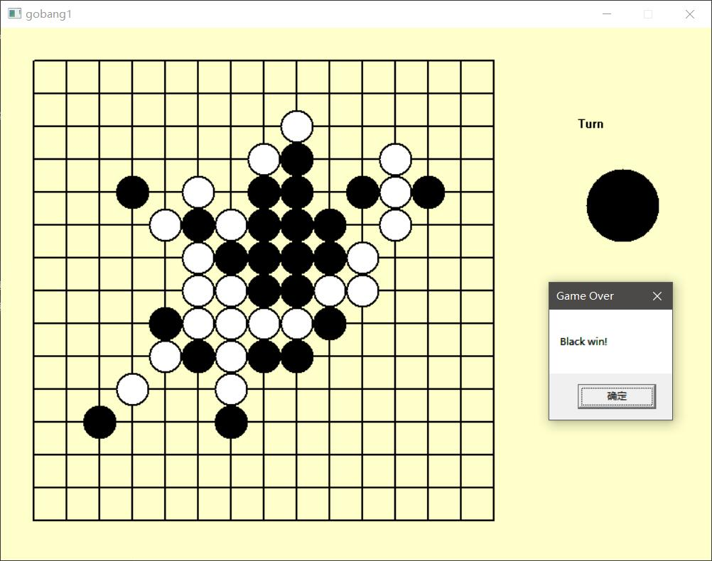
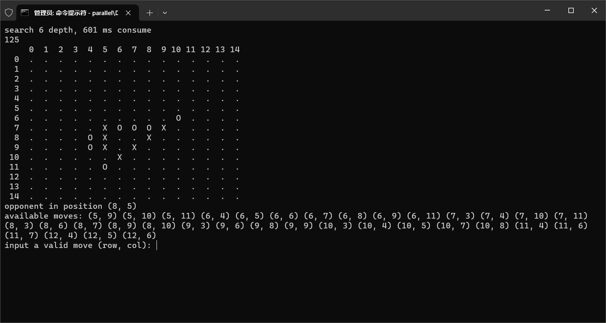

# Gobang Based on Searching

**sequential version (GUI):**


**parallel version:**

## Build

environment:

+ win10
+ VS2022

dependency: 

+ easyx
+ OpenMP

```shell
mkdir build && cd build
cmake ..
cmake --build .
```

sequential version is `sequential\Debug\gobang1.exe`, parallel version is `parallel\Debug\gobang2.exe`

**Chinese tutorial**: [五子棋AI设计](https://cszhouy.github.io/blog/47e2e24c.html)